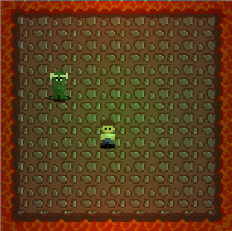

# Introduction

In this section of the book, we are going to learn how to make a simple game using tuber.

The game is called **Escape Orcs 2**. It's a 2D top-down survival game where the player's character has to survive the 
longest time among self-replicating orcs.

